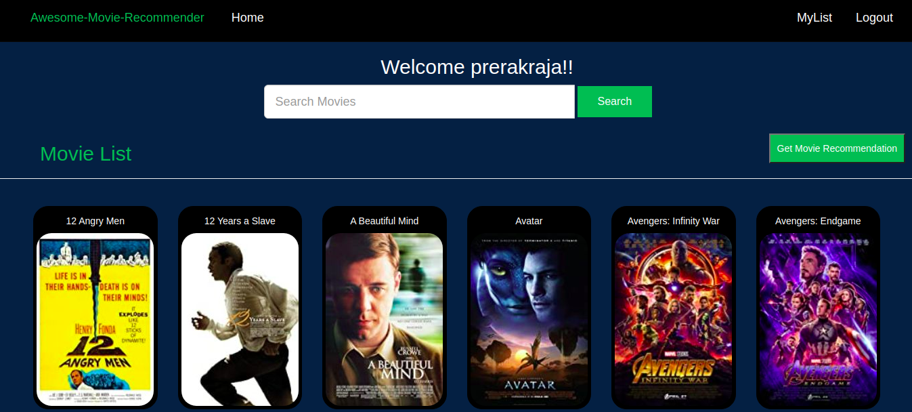
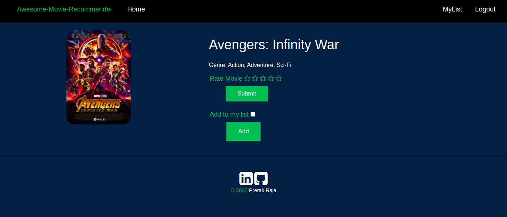

# Movie Genre Prediction and Recommendation System

A Django web application where users can browse movies, search by title, rate movies, manage a personal watchlist, and get movie recommendations based on user rating patterns.

## Project Overview

This project is a movie recommendation system built with Django. It stores movie details, user ratings, and watchlist choices in a database. Based on the ratings submitted by users, the app uses collaborative filtering to recommend movies that match similar user preferences.

The project is useful for demonstrating:

- Django models, views, templates, and URL routing
- User registration, login, and logout
- CRUD-style interactions for ratings and watchlists
- A basic recommendation algorithm using Pandas
- A full-stack web application workflow from local setup to deployment preparation

## Features

- User registration and login
- Movie listing with poster images
- Movie search by title
- Movie detail page with genre information
- Star rating submission
- Personal watchlist support
- Personalized movie recommendation page
- Django admin support for managing movies, ratings, and watchlist records

## Tech Stack

- **Backend:** Django 3.0.6
- **Database:** SQLite
- **Recommendation logic:** Pandas, NumPy, SciPy
- **Frontend:** HTML, CSS, Bootstrap, jQuery
- **Static/media handling:** WhiteNoise, local media files, optional AWS S3 settings
- **Deployment tools:** Gunicorn, Procfile

## Website Preview

### Home Page



### Detail Page



## Folder Structure

```text
Movie-Genre-Prediction/
├── manage.py
├── requirements.txt
├── Procfile
├── db.sqlite3
├── media/
├── website_images/
├── movie_recommender/
│   ├── settings.py
│   ├── urls.py
│   ├── wsgi.py
│   └── aws/
└── recommend/
    ├── models.py
    ├── views.py
    ├── forms.py
    ├── urls.py
    ├── admin.py
    ├── tests.py
    ├── migrations/
    ├── static/
    └── templates/
```

## Local Setup

### 1. Clone the repository

```bash
git clone <your-repository-url>
cd Movie-Genre-Prediction
```

### 2. Create and activate a virtual environment

On Windows:

```bash
python -m venv venv
venv\Scripts\activate
```

On macOS/Linux:

```bash
python -m venv venv
source venv/bin/activate
```

### 3. Install dependencies

```bash
pip install -r requirements.txt
```

### 4. Apply database migrations

```bash
python manage.py migrate
```

### 5. Run the development server

```bash
python manage.py runserver
```

Open the app in your browser:

```text
http://127.0.0.1:8000/
```

## How the Recommendation Works

The recommendation feature uses user-based collaborative filtering. In simple terms, the app compares movie rating patterns between users. If two users rate some movies similarly, the system assumes they may have similar taste and recommends movies liked by users with matching preferences.

Current flow:

1. Collect all user movie ratings.
2. Create a user-movie rating table using Pandas.
3. Calculate similarity between rated movies.
4. Recommend highly related movies that the current user has not rated yet.

This is a simple recommendation approach and is suitable for learning. Future improvements can make it more reliable for new users, larger datasets, and production use.

## Testing

Run Django's system check:

```bash
python manage.py check
```

Run tests:

```bash
python manage.py test
```

At the moment, the project has limited test coverage. Adding tests for authentication, movie search, ratings, watchlist actions, and recommendation edge cases is a planned improvement.

## Deployment Notes

The project includes a `Procfile` and Gunicorn dependency, which can be used for platform-based deployment. Before deploying publicly, update the production configuration:

- Move `SECRET_KEY` into an environment variable
- Set `DEBUG=False`
- Configure `ALLOWED_HOSTS`
- Configure static and media file handling
- Avoid committing production database files
- Run Django deployment checks

```bash
python manage.py check --deploy
```

## Future Improvements

- Improve README and setup documentation
- Move sensitive settings to environment variables
- Refactor large view functions into smaller helpers/services
- Add error handling for users with no ratings
- Add tests for important user flows
- Improve UI consistency and empty states
- Optimize recommendation logic for better performance
- Prepare a cleaner production deployment setup

## Interview Talking Point

This project shows a practical full-stack Django application with authentication, database models, user interactions, and a recommendation feature. The improvement plan focuses on making the project cleaner and more professional through small, meaningful commits instead of rewriting everything at once.
